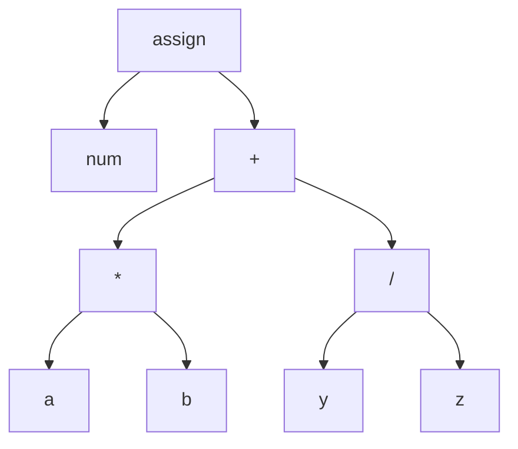

#  <b> Compiler Lecture  </b>
* [Aim of This Repository](#aim)
* [Section 1 - Basic Of Compiler](#sect1)
    * [Front-End](#front)
    * [Optimizer](#optimizer)
    * [Back-End](#back)
    * [Calc Language Application](#calc)

<a name="aim"></a>

## <b> Aim of This Repository </b>
&nbsp; The aim of this repository is to keep the applications in the books which I've been studying on about the field of compilers while I trying to improve myself. Since this repository is related to the compilers area, the applications here will be made with the LLVM library.</br>

<b>[WARNING!]</b> Most of the information in this repository is a summary of what I have read and understood myself. The information here may not be completely accurate. For more detailed information on compilers, please study the <b>Aho's Dragon book and Kai Nacke's LLVM book</b>.

<a name="sect1"></a>

##  <b> Section 1 - Basics Of Compiler  </b>
&nbsp; In this section a very simple application is developed to understand the basic steps of a compiler. </br>

&nbsp; Before explaining the steps of a compiler, it is better to first explain what a compiler is and what it does. </br>

&nbsp; <b><i>A Compiler</i></b> is <b>a program</b> that converts the code in the source file (files such as .java, .cpp, .py, etc.) into machine code that the computer can understand.

&nbsp; A compiler consists of 3 steps. </br>
These steps are Front-End, Optimizer and Back-End and these steps consist of sub-steps within themselves.
* [Front-End](#front)
    * [Scanning Analyzer / Lexer](#lexer)
    * [Syntactic Analyzer / Parser](#parser)
    * [Semantic Analyzer](#semantic)
* [Optimizer](#optimizer)
* [Back-End](#back)
    * [Instruction Selection](#insSel)
    * [Instruction Scheduling](#insSch)
    * [Register Allocation](#regAlloc)

<a name="front"></a>

### <b> Front-End </b>
&nbsp; You can think of the code in the source file(source files such as .c, .java, .js, etc.) as an ordinary text in a text document (like .txt file) at this stage. </br>

<a name="lexer"></a>

#### <b> Scanning Analyzer (Lexer) </b>
&nbsp; <b><i>The Lexer</i></b> reads one by one characters in the source file until it detects the characters like  '+' ,'=', ';' etc. expression and creates a special object called Token with the characters it reads. </br>

An example of code and its split into Token objects are in below.
```python
# Token Code Example;
x1 = a3 + 5;
x'2;
```
```
# Tokens of the code example;

x1  is a  Token (identifier)
=   is a  Token (assignment operator)
a3  is a  Token (identifier)
+   is a  Token (+)
5   is a  Token (number)
;   is a  Token (end of statement)

x'2 is an Invalid Token
;   is a  Token (end of statement)
```
&nbsp; <b>Note: </b> <i>a3 + 5</i> also called an <b>EXPRESSION</b>

<a name="parser"></a>

#### <b> Syntactic Analyzer (Parser) </b>

&nbsp; <b><i>The Parser</i></b> makes statements with tokens just like people make sentences with words. Tokens obtained in the previous section (Lexer sect.) are used to establish the statements. The statements are then converted into <b>a special data structure called the Abstract Syntax Tree (A.S.T.)</b>.

&nbsp; <b>The aim of Parser</b> is to understand whether the grammar created is correct or not and to debug in A.S.T..

&nbsp; <b>Grammar</b> is the rules given to programmer for compiler have a valid statement. 

The code that each token is used correctly but <b>the grammar is wrong</b> in below.
```python
# Invalid Grammar Example;
num = a*b +/;
```

Grammatically correct code is in below.
```python
# Valid Grammar Example;
num = a*b + y/z;
```
Grammatically correct code is shown as an A.S.T. graph in below.

<a name="semantic"></a>

#### <b> Semantic Analyzer </b>
&nbsp; <b><i>The Semantic Analyzer</i></b> checks whether the written code is meaningful even if the code written in the source file is grammatically correct. </br>

There are examples where a sentence or code may be meaningless even if it is grammatically correct in the below.
```
Sentence example; 
His home is going to he.

Explanation: This sentence is grammatically correct but meaningless.

-----------------
Code example;
5 = x;

Explanation: A value of 5 is an real value and x is a local value(represents the memory address).
A real value can be assigned to a local variable, but the opposite is meaningless.
```
&nbsp; <b>Compilers</b> only must generate meaningful code.

Now that it's understood that a code can be meaningless even if it is grammatically correct, let's take a real-life example.
```cpp
Animal a1, a2;
Person p;
Computer c;
int x;
x = p - c;
```
&nbsp; When we write code in a source file in real life, <b>Symbol Table</b> is called for each of our declarations and each variables of the declarations. </br>

&nbsp; As it can be understood, declared variables in our source code in  <b>Symbol Table</b>, their scope fields etc. information is available. </br>

&nbsp; The Compiler can understand that the above example contains meaningless codes by checking the Symbol Table in the Semantic Analyzer during compilation.

<a name="optimizer"></a>

### <b> Optimizer </b>
&nbsp; <b><i>The Optimizer</i></b> tries to optimize the A.S.T. data structure obtained at the end of the front-end stage of the compiler <b>independently of the target machine</b>(architectures such as x86, arm, gpu, etc.).

&nbsp; <b>Our aim is to hope to make the code faster in optimization.</b>

&nbsp; There are different methods and approaches for these optimization processes. The most common of these is the Command Subexpression Elimination(CSE). To summarize the CSE approach roughly and to give a simple example, if there are more than one repetitive operations, those operations are assigned to a variable. When those operations are needed, they are used from the variables they are assigned.

&nbsp; Optimizer and Compiler solutions are a kind of <b>heuristic algorithms.</b>
<a name="back"></a>

### <b> Back-End </b>

<a name="insSel"></a>

#### <b> Instruction Selection </b>

<a name="insSch"></a>

#### <b> Instruction Scheduling </b>

<a name="regAlloc"></a>

#### <b> Register Allocation </b>

<a name="calc"></a>

### <b> Calc Language Application</b>