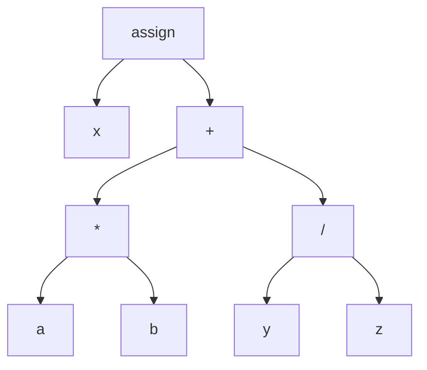

#  <b> Compiler Lecture  </b>
* [Aim of This Repository](#aim)
* [Section 1 - Basic Of Compiler](#sect1)
    * [Front-End](#front)
    * [Optimizer](#optimizer)
    * [Back-End](#back)
    * [Calc Language Application](#calc)

<a name="aim"></a>

## <b> Aim of This Repository </b>
&nbsp; The aim of this repository is to keep the applications in the books which I've been studying on about the field of compilers while I trying to improve myself. Since this repository is related to the compilers area, the applications here will be made with the LLVM library.</br>

<b>[WARNING!]</b> Most of the information in this repository is a summary of what I have read and understood myself. The information here may not be completely accurate. For more detailed information on compilers, please study the <b>Aho's Dragon book and Kai Nacke's LLVM book</b>.

<a name="sect1"></a>

##  <b> Section 1 - Basics Of Compiler  </b>
&nbsp; In this section a very simple application is developed to understand the basic steps of a compiler. </br>
A compiler consists of 3 steps. </br>
These steps are Front-End, Optimizer and Back-End and these steps consist of sub-steps within themselves.
* Front-End
    * Scanning Analyzer / Lexer
    * Syntactic Analyzer / Parser
    * Semantic Analyzer
* Optimizer
* Back-End
    * Instruction Selection
    * Instruction Scheduling
    * Register Allocation

<a name="front"></a>

### <b> Front-End </b>
#### <b> Scanning Analyzer (Lexer) </b>
&nbsp; You can think of the code in the source file (.cpp, .java, .py, etc.) as an ordinary text in a text document (like .txt) at this stage. </br>

&nbsp; Scanner Analyzer(Lexer) reads one by one characters in the source file until it detects the characters like  '+' ,'=', ';' etc. expression and creates a special object called Token with the characters it reads. </br>

An example of code and its split into Token objects are in below.
```python
# Token Code Example;
x1 = a3 + 5;
x'2;
```
```
# Tokens of the code example;

x1  is a  Token (identifier)
=   is a  Token (assignment operator)
a3  is a  Token (identifier)
+   is a  Token (+)
5   is a  Token (number)
;   is a  Token (end of statement)

x'2 is an Invalid Token
;   is a  Token (end of statement)
```
&nbsp; <b>Note: </b> <i>a3 + 5</i> also called an <b>EXPRESSION</b>


#### <b> Syntactic Analyze (Parser) </b>

&nbsp; <b>Parser</b> makes statements with tokens just like people make sentences with words. Tokens obtained in the previous section (Lexer sect.) are used to establish the statements. The statements are then converted into <b>a special data structure called the Abstract Syntax Tree (A.S.T.)</b>.

&nbsp; <b>The aim of Parser</b> is to understand whether the grammar created is correct or not and to debug in A.S.T..

&nbsp; <b>Grammar</b> is the rules given to programmer for compiler have a valid statement. 

The code that each token is used correctly but <b>the grammar is wrong</b> in below.
```python
# Invalid Gramer Example;
x = a*b +/;
```

Grammatically correct code is in below.
```python
# Grammatically Correct Code for A.S.T. Example;
x = a*b + y/z;
```
Grammatically correct code is shown as an AST graph in below.


#### <b> Semantic Analyzer </b>

<a name="optimizer"></a>

### <b> Optimizer </b>

<a name="back"></a>

### <b> Back-End </b>
#### <b> Instruction Selection </b>
#### <b> Instruction Scheduling </b>
#### <b> Register Allocation </b>

<a name="calc"></a>

### <b> Calc Language Application</b>